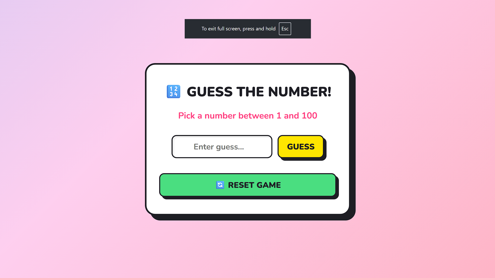

# 🎯 Neo-Brutalist Number Guessing Game

A bold, interactive, and visually striking number guessing game built with a modern **neo-brutalist UI** and smooth backend logic.

  

👉 **[Try out by your own](https://number-guessing-game-x97n.onrender.com)**

---

## 🕹️ How It Works (Fun + Interactive)

Welcome to a guessing game that actually *talks back* 😎

Here’s how the magic unfolds:

- You enter a number between **1 and 100** (and yes, you can just hit **Enter** to submit ⚡).
- The game instantly reacts with **dynamic, emoji-filled feedback**:
  - 🔥 *“Very close! Think higher”*
  - 🙂 *“Close! Try lower”*
  - ❄️ *“Way off! Go higher”*
- Every guess triggers:
  - 💥 A **screen “pop” animation** that makes feedback feel alive
  - 🟦 A **bouncy, physical button click effect** (neo-brutalism at its finest)
- The UI is intentionally **raw, bold, and unapologetic** — embracing the **neo-brutalist design style** with sharp contrasts, thick borders, and playful motion.

It’s not just a game… it’s an *experience*.

---

## ⚙️ Tech Stack / Languages Used

### 🎨 Frontend
- **HTML5** – Structure of the game
- **CSS3** – Neo-brutalist styling, animations, and UI effects
- **Vanilla JavaScript** – DOM manipulation, event handling, and API communication

### 🧠 Backend
- **Python (Flask)** – Handles game logic, number generation, and API routes

### 🚀 Deployment
- **Render** – Hosting platform
- **Gunicorn** – Production-ready WSGI server

---

## 👥 Team & Credits

This project is a result of strong collaboration and clear division of roles:

- **Sougata**  
  ➤ Handled the complete **Backend architecture** (Flask server, game logic, API routing)

- **Adarsh (GitHub: adarsh-clushXD)**  
  ➤ Designed and developed the complete **Frontend** (Neo-brutalist UI, animations, client-side logic)

> 💡 Together, the team combined design and logic to deliver a seamless and engaging user experience.

---

## 💻 Local Installation & Setup

Want to run it on your own machine? Follow these simple steps:

### 1️⃣ Clone the Repository
 ```
git clone https://github.com/your-username/your-repo-name.git
cd your-repo-name
```

### 2️⃣ Create Virtual Environment
```
python -m venv venv
```

### 3️⃣ Activate Virtual Environment

Windows:
```
venv\Scripts\activate
```
Mac/Linux:
```
source venv/bin/activate
```

### 4️⃣ Install Dependencies
```
pip install -r requirements.txt
```

### 5️⃣ Run the Application
```
python game.py
```

### 6️⃣ Open in Browser
```
http://127.0.0.1:5000
```

---

## 🌟 Final Note

This project blends clean backend engineering with a bold, unconventional UI style to create something memorable. Whether you're here to play, learn, or get inspired — you're in the right place.

---

💬 Feel free to fork, contribute, or drop a ⭐ if you like the project!
